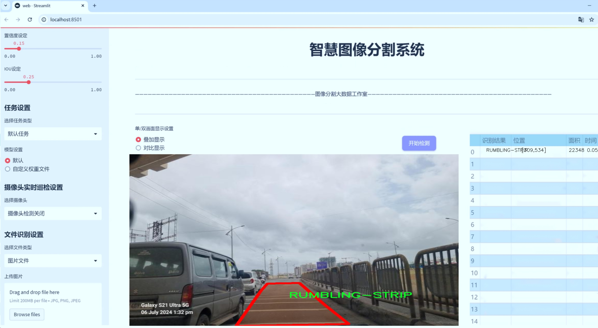
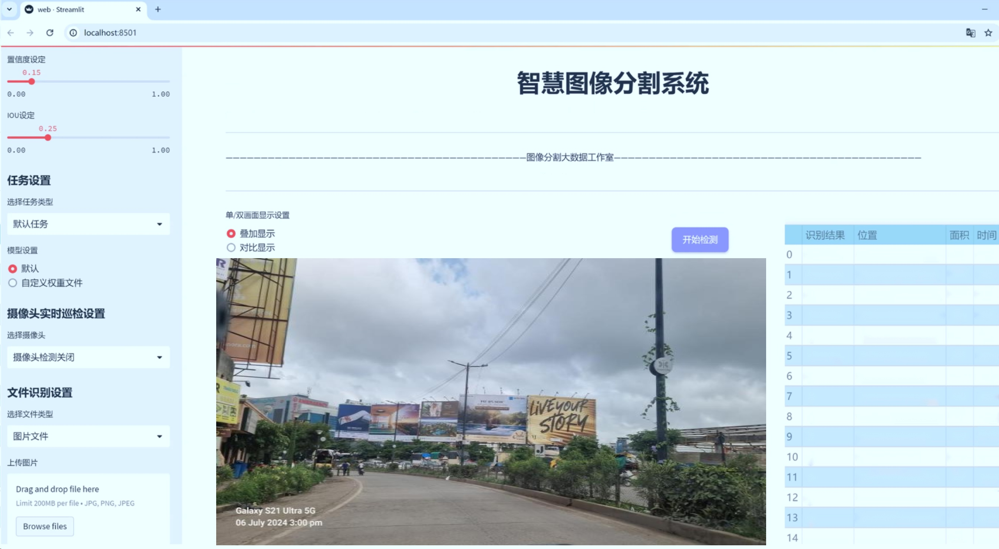
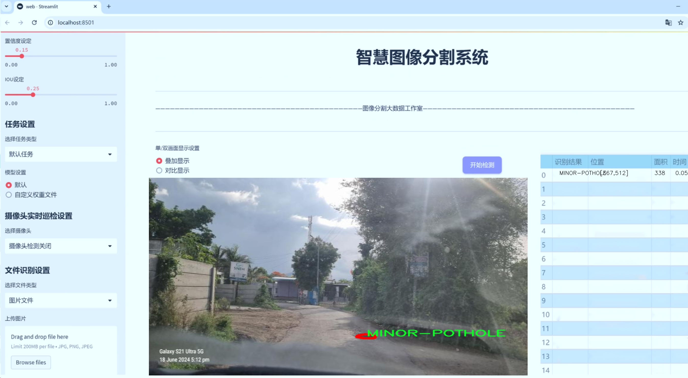
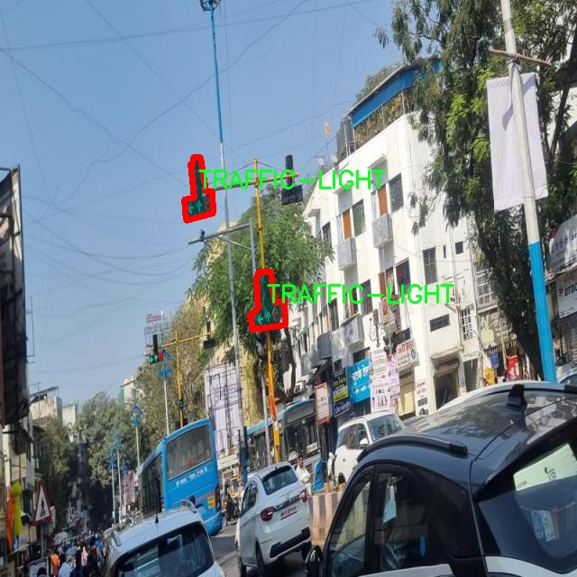
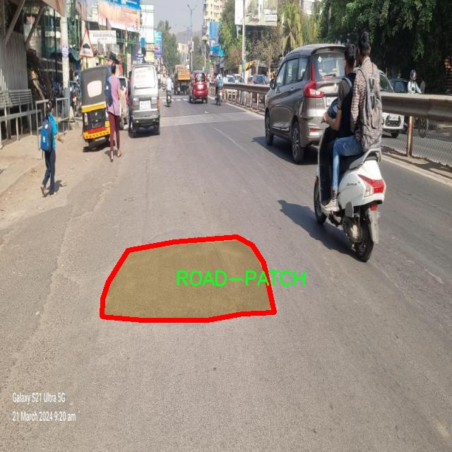
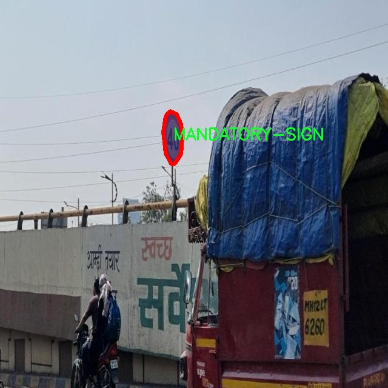
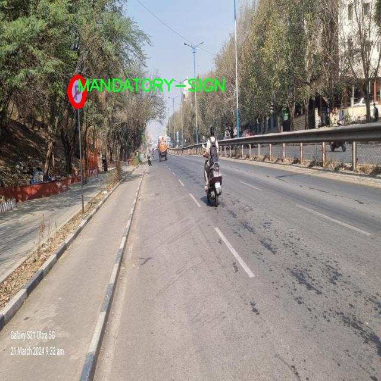
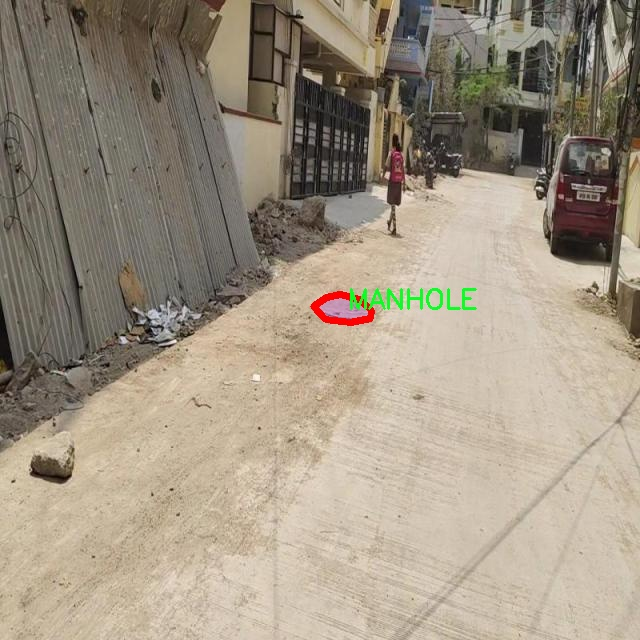

# 道路坑洞城市交通设施分割系统源码＆数据集分享
 [yolov8-seg-C2f-DWR＆yolov8-seg-C2f-SCConv等50+全套改进创新点发刊_一键训练教程_Web前端展示]

### 1.研究背景与意义

项目参考[ILSVRC ImageNet Large Scale Visual Recognition Challenge](https://gitee.com/YOLOv8_YOLOv11_Segmentation_Studio/projects)

项目来源[AAAI Global Al lnnovation Contest](https://kdocs.cn/l/cszuIiCKVNis)

研究背景与意义

随着城市化进程的加速，城市交通设施的管理与维护日益成为现代城市治理的重要组成部分。道路坑洞作为城市交通设施中的一个普遍问题，不仅影响交通安全，还可能导致经济损失和环境污染。因此，开发一种高效、准确的道路坑洞及其他交通设施的自动化分割系统，具有重要的现实意义和应用价值。近年来，深度学习技术的迅猛发展为图像分割任务提供了新的解决方案，其中YOLO（You Only Look Once）系列模型因其高效的实时检测能力而备受关注。YOLOv8作为该系列的最新版本，凭借其改进的网络结构和算法，展现出了在目标检测和分割任务中的优越性能。

本研究旨在基于改进的YOLOv8模型，构建一个针对城市交通设施的分割系统，重点关注道路坑洞的识别与分类。为实现这一目标，我们使用了包含1100张图像的hotelhawaiUD180数据集，该数据集涵盖了22个类别的交通设施，包括主要和次要坑洞、交通标志、监控摄像头等。这些类别的多样性为模型的训练提供了丰富的样本，有助于提高分割系统的泛化能力和准确性。

在现有的交通设施管理中，传统的人工巡检方法效率低下，且容易受到人为因素的影响。通过引入基于YOLOv8的自动化分割系统，我们能够实现对城市交通设施的实时监测与评估，进而提高管理效率和决策的科学性。此外，系统的自动化程度将大大降低人力成本，减少因交通设施损坏而导致的事故风险，提升城市交通的安全性和流畅性。

本研究的意义不仅体现在技术层面，还在于其对城市交通管理的深远影响。通过精确的交通设施分割与识别，城市管理者能够及时掌握道路状况，制定合理的维护计划，优化资源配置，进而提升城市的整体交通服务水平。同时，系统的应用还将为后续的智能交通系统建设奠定基础，推动城市交通管理向智能化、数字化转型。

综上所述，基于改进YOLOv8的道路坑洞城市交通设施分割系统的研究，不仅具有重要的学术价值，还在实际应用中展现出广阔的前景。通过深入探讨该系统的设计与实现，我们期望为城市交通设施的智能化管理提供新的思路与方法，为构建安全、高效、可持续的城市交通环境贡献力量。

### 2.图片演示







##### 注意：由于此博客编辑较早，上面“2.图片演示”和“3.视频演示”展示的系统图片或者视频可能为老版本，新版本在老版本的基础上升级如下：（实际效果以升级的新版本为准）

  （1）适配了YOLOV8的“目标检测”模型和“实例分割”模型，通过加载相应的权重（.pt）文件即可自适应加载模型。

  （2）支持“图片识别”、“视频识别”、“摄像头实时识别”三种识别模式。

  （3）支持“图片识别”、“视频识别”、“摄像头实时识别”三种识别结果保存导出，解决手动导出（容易卡顿出现爆内存）存在的问题，识别完自动保存结果并导出到tempDir中。

  （4）支持Web前端系统中的标题、背景图等自定义修改，后面提供修改教程。

  另外本项目提供训练的数据集和训练教程,暂不提供权重文件（best.pt）,需要您按照教程进行训练后实现图片演示和Web前端界面演示的效果。

### 3.视频演示

[3.1 视频演示](https://www.bilibili.com/video/BV1ZRyBYREbW/)

### 4.数据集信息展示

##### 4.1 本项目数据集详细数据（类别数＆类别名）

nc: 22
names: ['BUS-STOP', 'CAUTIONARY-SIGN', 'CCTV', 'CRACK', 'ELECTRIC-FEEDER', 'EXPANSION-JOINT', 'GANTRY-BOARD', 'HOARDING', 'HOTSPOT', 'INFORMATORY-SIGN', 'MAJOR-POTHOLE', 'MANDATORY-SIGN', 'MANHOLE', 'MINOR-POTHOLE', 'PEDESTRIAN-CROSSING', 'PETROL-PUMP', 'RAVELLING', 'ROAD-PATCH', 'RUMBLING-STRIP', 'STREET-LIGHT', 'TRAFFIC-LIGHT', 'TREES']


##### 4.2 本项目数据集信息介绍

数据集信息展示

在本研究中，我们采用了名为“hotelhawaiUD180”的数据集，以支持改进YOLOv8-seg的道路坑洞及城市交通设施分割系统的训练和验证。该数据集专注于城市环境中的多种交通设施及道路状况，其设计旨在提升计算机视觉模型在复杂场景下的识别和分割能力。数据集包含22个类别，涵盖了从交通标志到道路缺陷的多种对象，这些对象在城市交通管理和安全监控中扮演着至关重要的角色。

数据集中包含的类别包括：公交站（BUS-STOP）、警告标志（CAUTIONARY-SIGN）、闭路电视（CCTV）、裂缝（CRACK）、电力供给器（ELECTRIC-FEEDER）、扩展接缝（EXPANSION-JOINT）、横幅板（GANTRY-BOARD）、围挡（HOARDING）、热点区域（HOTSPOT）、信息标志（INFORMATORY-SIGN）、重大坑洞（MAJOR-POTHOLE）、强制性标志（MANDATORY-SIGN）、人孔（MANHOLE）、小型坑洞（MINOR-POTHOLE）、人行横道（PEDESTRIAN-CROSSING）、加油站（PETROL-PUMP）、路面剥落（RAVELLING）、道路修补（ROAD-PATCH）、颠簸带（RUMBLING-STRIP）、路灯（STREET-LIGHT）、交通信号灯（TRAFFIC-LIGHT）以及树木（TREES）。这些类别的多样性不仅反映了城市交通设施的复杂性，也为模型的训练提供了丰富的场景和背景，增强了其泛化能力。

在数据集的构建过程中，研究团队通过高质量的图像采集和标注，确保了每个类别的准确性和完整性。图像来源于不同的城市环境，涵盖了多种天气条件和光照变化，旨在模拟真实世界中的复杂情况。这种多样性使得训练出来的模型能够更好地适应各种实际应用场景，如智能交通监控、自动驾驶车辆的环境感知等。

此外，数据集的标注不仅包括对象的类别信息，还涵盖了对象的边界框和分割掩码。这一细致的标注方式为YOLOv8-seg模型的训练提供了充分的监督信号，使得模型能够学习到更加精确的特征表示，从而提高分割的准确性和鲁棒性。通过对这些数据的深度学习，模型能够在复杂的城市环境中有效识别和分割出各类交通设施及道路缺陷，为城市交通管理提供重要的技术支持。

综上所述，“hotelhawaiUD180”数据集为本研究提供了丰富的训练素材，涵盖了多种城市交通设施和道路状况。通过对该数据集的深入分析和应用，我们期望能够显著提升YOLOv8-seg模型在道路坑洞及城市交通设施分割任务中的表现，为未来的智能交通系统发展奠定坚实的基础。











### 5.全套项目环境部署视频教程（零基础手把手教学）

[5.1 环境部署教程链接（零基础手把手教学）](https://www.bilibili.com/video/BV1jG4Ve4E9t/?vd_source=bc9aec86d164b67a7004b996143742dc)


[5.2 安装Python虚拟环境创建和依赖库安装视频教程链接（零基础手把手教学）](https://www.bilibili.com/video/BV1nA4VeYEze/?vd_source=bc9aec86d164b67a7004b996143742dc)

### 6.手把手YOLOV8-seg训练视频教程（零基础小白有手就能学会）

[6.1 手把手YOLOV8-seg训练视频教程（零基础小白有手就能学会）](https://www.bilibili.com/video/BV1cA4VeYETe/?vd_source=bc9aec86d164b67a7004b996143742dc)


按照上面的训练视频教程链接加载项目提供的数据集，运行train.py即可开始训练



     Epoch   gpu_mem       box       obj       cls    labels  img_size
     1/200     0G   0.01576   0.01955  0.007536        22      1280: 100%|██████████| 849/849 [14:42<00:00,  1.04s/it]
               Class     Images     Labels          P          R     mAP@.5 mAP@.5:.95: 100%|██████████| 213/213 [01:14<00:00,  2.87it/s]
                 all       3395      17314      0.994      0.957      0.0957      0.0843

     Epoch   gpu_mem       box       obj       cls    labels  img_size
     2/200     0G   0.01578   0.01923  0.007006        22      1280: 100%|██████████| 849/849 [14:44<00:00,  1.04s/it]
               Class     Images     Labels          P          R     mAP@.5 mAP@.5:.95: 100%|██████████| 213/213 [01:12<00:00,  2.95it/s]
                 all       3395      17314      0.996      0.956      0.0957      0.0845

     Epoch   gpu_mem       box       obj       cls    labels  img_size
     3/200     0G   0.01561    0.0191  0.006895        27      1280: 100%|██████████| 849/849 [10:56<00:00,  1.29it/s]
               Class     Images     Labels          P          R     mAP@.5 mAP@.5:.95: 100%|███████   | 187/213 [00:52<00:00,  4.04it/s]
                 all       3395      17314      0.996      0.957      0.0957      0.0845


### 7.50+种全套YOLOV8-seg创新点代码加载调参视频教程（一键加载写好的改进模型的配置文件）

[7.1 50+种全套YOLOV8-seg创新点代码加载调参视频教程（一键加载写好的改进模型的配置文件）](https://www.bilibili.com/video/BV1Hw4VePEXv/?vd_source=bc9aec86d164b67a7004b996143742dc)

### 8.YOLOV8-seg图像分割算法原理

原始YOLOV8-seg算法原理

YOLOv8-seg算法是2023年由Ultralytics推出的一款新型目标检测与分割模型，它在YOLO系列的基础上进行了多项创新与改进，旨在实现更高效的实时目标检测与分割。该算法的设计灵感源自于之前的YOLOv3、YOLOv5等版本，同时融合了YOLOX、YOLOv6、YOLOv7及PPYOLOE等算法的优点，形成了一种新的检测架构。YOLOv8-seg不仅具备高精度和快速处理能力，还在处理复杂场景和多目标检测方面展现出优异的性能，尤其适用于如苹果采摘等农业自动化领域。

YOLOv8-seg的网络结构主要由输入层、主干网络、颈部网络和头部网络组成。输入层负责将原始图像进行预处理，缩放至模型所需的输入尺寸。主干网络则通过多层卷积操作对图像进行特征提取。与YOLOv5相似，YOLOv8的主干网络采用了批归一化和SiLU激活函数，以增强模型的非线性表达能力。在特征提取过程中，YOLOv8引入了C2f模块，该模块通过跨层分支连接的方式，改善了梯度流动，从而提高了模型的学习效率和检测精度。C2f模块的设计灵感来源于YOLOv7中的E-ELAN结构，能够有效地处理多尺度特征，使得模型在面对不同大小目标时表现得更加稳健。

在主干网络的末尾，YOLOv8采用了SPPFl（Spatial Pyramid Pooling Layer）模块，该模块通过三个最大池化层处理多尺度特征，进一步增强了网络的特征抽象能力。这种设计使得YOLOv8能够在多种复杂场景下保持较高的检测精度，尤其是在目标大小变化较大的情况下。

颈部网络则负责将不同尺度的特征图进行融合，以便为后续的检测任务提供更为丰富的信息。YOLOv8采用了FPN（Feature Pyramid Network）和PAN（Path Aggregation Network）结构的结合，确保了多尺度特征之间的充分融合。这一结构的优势在于能够有效地利用不同层次的特征信息，从而提升目标检测的准确性和鲁棒性。

在检测头的设计上，YOLOv8采用了解耦的检测头结构。这一结构的核心在于将分类和定位任务分开处理，分别通过两条并行的卷积分支进行特征提取和损失计算。这种解耦设计使得模型在处理复杂场景时，能够更好地聚焦于目标的类别特征和位置特征，从而提高了检测的精度和效率。

YOLOv8在标签分配策略上也进行了创新，采用了TOOD（Task-Oriented Object Detection）策略，这是一种动态标签分配方法。与YOLOv5的静态聚类方法不同，TOOD策略能够根据实时的目标检测情况动态调整标签分配，从而更好地适应不同数据集的特征。这一策略的引入，使得YOLOv8在正负样本匹配上表现得更加灵活，能够有效降低因数据集不均衡带来的影响。

在损失函数的设计上，YOLOv8引入了Varifocal Loss（VFL）和CIoU Loss（Complete Intersection over Union Loss）等新型损失函数。VFL通过不对称参数对正负样本进行加权，强调高质量正样本对模型训练的重要性，同时降低负样本对损失的影响。这一设计有效地提高了模型对正样本的敏感性，使得模型在面对复杂背景时，能够更准确地识别目标。

YOLOv8-seg的整体架构和设计理念，充分体现了当前目标检测领域的前沿技术和研究趋势。其在特征提取、标签分配、损失计算等多个方面的创新，标志着YOLO系列算法在实时目标检测和分割任务中的又一次飞跃。尤其是在苹果采摘等实际应用中，YOLOv8-seg凭借其高效的视觉识别能力和快速的处理速度，能够为自动化农业带来显著的效益，推动农业生产的智能化和自动化进程。

总之，YOLOv8-seg算法通过对主干网络、颈部网络和检测头的全面优化，以及对标签分配和损失函数的创新设计，达到了实时检测的新高度。它不仅继承了YOLO系列的优良传统，还在多个关键技术上进行了突破，展现出强大的应用潜力和广阔的前景。随着技术的不断发展，YOLOv8-seg无疑将在目标检测领域产生深远的影响，推动相关研究和应用的进一步发展。


### 9.系统功能展示（检测对象为举例，实际内容以本项目数据集为准）

图9.1.系统支持检测结果表格显示

  图9.2.系统支持置信度和IOU阈值手动调节

  图9.3.系统支持自定义加载权重文件best.pt(需要你通过步骤5中训练获得)

  图9.4.系统支持摄像头实时识别

  图9.5.系统支持图片识别

  图9.6.系统支持视频识别

  图9.7.系统支持识别结果文件自动保存

  图9.8.系统支持Excel导出检测结果数据


### 10.50+种全套YOLOV8-seg创新点原理讲解（非科班也可以轻松写刊发刊，V11版本正在科研待更新）

#### 10.1 由于篇幅限制，每个创新点的具体原理讲解就不一一展开，具体见下列网址中的创新点对应子项目的技术原理博客网址【Blog】：


[10.1 50+种全套YOLOV8-seg创新点原理讲解链接](https://gitee.com/qunmasj/good)

#### 10.2 部分改进模块原理讲解(完整的改进原理见上图和技术博客链接)【如果此小节的图加载失败可以通过CSDN或者Github搜索该博客的标题访问原始博客，原始博客图片显示正常】

### YOLOv8简介
YOLOv8是一种目标检测模型，是基于YOLO (You Only Look Once)系列算法发展而来的最新版本。它的核心思想是将目标检测任务转化为一个回归问题，通过单次前向传播即可直接预测出图像中的多个目标的位置和类别。
YOLOv8的网络结构采用了Darknet作为其主干网络，主要由卷积层和池化层构成。与之前的版本相比，YOLOv8在网络结构上进行了改进，引入了更多的卷积层和残差模块，以提高模型的准确性和鲁棒性。
YOLOv8采用了一种特征金字塔网络(Feature Pyramid Network,FPN)的结构，通过在不同层级上融合多尺度的特征信息，可以对不同尺度的目标进行有效的检测。此外，YOLOv8还引入了一种自适应感知域(Adaptive Anchors
的机制，通过自适应地学习目标的尺度和
长宽比，提高了模型对于不同尺度和形状目标的检测效果。
总体来说，YOLOv8结构模型综合了多个先进的目标检测技术，在保证检测速度的同时提升了检测精度和鲁棒性，被广泛应用于实时目标检测任务中。


#### yolov8网络模型结构图

YOLOv8 (You Only Look Once version 8)是一种目标检测算法，它在实时场景下可以快速准确地检测图像中的目标。
YOLOv8的网络模型结构基于Darknet框架，由一系列卷积层、池化层和全连接层组成。主要包含以下几个组件:
1.输入层:接收输入图像。
2.卷积层:使用不同尺寸的卷积核来提取图像特征。
3.残差块(Residual blocks):通过使用跳跃连接(skip connections）来解决梯度消失问题，使得网络更容易训练。
4.上采样层(Upsample layers):通过插值操作将特征图的尺寸放大，以便在不同尺度上进行目标检测。
5.池化层:用于减小特征图的尺寸，同时保留重要的特征。
6.1x1卷积层:用于降低通道数，减少网络参数量。
7.3x3卷积层:用于进—步提取和组合特征。
8.全连接层:用于最后的目标分类和定位。
YOLOv8的网络结构采用了多个不同尺度的特征图来检测不同大小的目标，从而提高了目标检测的准确性和多尺度性能。
请注意，YOLOv8网络模型结构图的具体细节可能因YOLO版本和实现方式而有所不同。


#### yolov8模型结构
YOLOv8模型是一种目标检测模型，其结构是基于YOLOv3模型进行改进的。模型结构可以分为主干网络和检测头两个部分。
主干网络是一种由Darknet-53构成的卷积神经网络。Darknet-53是一个经过多层卷积和残差连接构建起来的深度神经网络。它能够提取图像的特征信息，并将这些信息传递给检测头。
检测头是YOLOv8的关键部分，它负责在图像中定位和识别目标。检测头由一系列卷积层和全连接层组成。在每个检测头中，会生成一组锚框，并针对每个锚框预测目标的类别和位置信息。
YOLOv8模型使用了预训练的权重，其中在COCO数据集上进行了训练。这意味着该模型已经通过大规模数据集的学习，具有一定的目标检测能力。

### RT-DETR骨干网络HGNetv2简介
#### RT-DETR横空出世
前几天被百度的RT-DETR刷屏，参考该博客提出的目标检测新范式对原始DETR的网络结构进行了调整和优化，以提高计算速度和减小模型大小。这包括使用更轻量级的基础网络和调整Transformer结构。并且，摒弃了nms处理的detr结构与传统的物体检测方法相比，不仅训练是端到端的，检测也能端到端，这意味着整个网络在训练过程中一起进行优化，推理过程不需要昂贵的后处理代价，这有助于提高模型的泛化能力和性能。


当然，人们对RT-DETR之所以产生浓厚的兴趣，我觉得大概率还是对YOLO系列审美疲劳了，就算是出到了YOLO10086，我还是只想用YOLOv5和YOLOv7的框架来魔改做业务。。

#### 初识HGNet
看到RT-DETR的性能指标，发现指标最好的两个模型backbone都是用的HGNetv2，毫无疑问，和当时的picodet一样，骨干都是使用百度自家的网络。初识HGNet的时候，当时是参加了第四届百度网盘图像处理大赛，文档图像方向识别专题赛道，简单来说，就是使用分类网络对一些文档截图或者图片进行方向角度分类。


当时的方案并没有那么快定型，通常是打榜过程发现哪个网络性能好就使用哪个网络做魔改，而且木有显卡，只能蹭Ai Studio的平台，不过v100一天8小时的实验时间有点短，这也注定了大模型用不了。 

流水的模型，铁打的炼丹人，最后发现HGNet-tiny各方面指标都很符合我们的预期，后面就一直围绕它魔改。当然，比赛打榜是目的，学习才是享受过程，当时看到效果还可以，便开始折腾起了HGNet的网络架构，我们可以看到，PP-HGNet 针对 GPU 设备，对目前 GPU 友好的网络做了分析和归纳，尽可能多的使用 3x3 标准卷积（计算密度最高），PP-HGNet是由多个HG-Block组成，细节如下：


ConvBNAct是啥？简单聊一聊，就是Conv+BN+Act，CV Man应该最熟悉不过了：
```python
class ConvBNAct(TheseusLayer):
    def __init__(self,
                 in_channels,
                 out_channels,
                 kernel_size,
                 stride,
                 groups=1,
                 use_act=True):
        super().__init__()
        self.use_act = use_act
        self.conv = Conv2D(
            in_channels,
            out_channels,
            kernel_size,
            stride,
            padding=(kernel_size - 1) // 2,
            groups=groups,
            bias_attr=False)
        self.bn = BatchNorm2D(
            out_channels,
            weight_attr=ParamAttr(regularizer=L2Decay(0.0)),
            bias_attr=ParamAttr(regularizer=L2Decay(0.0)))
        if self.use_act:
            self.act = ReLU()
 
    def forward(self, x):
        x = self.conv(x)
        x = self.bn(x)
        if self.use_act:
            x = self.act(x)
        return x 
```
且标准卷积的数量随层数深度增加而增多，从而得到一个有利于 GPU 推理的骨干网络，同样速度下，精度也超越其他 CNN ，性价比也优于ViT-base模型。


另外，我们可以看到：

PP-HGNet 的第一层由channel为96的Stem模块构成，目的是为了减少参数量和计算量。PP-HGNet

Tiny的整体结构由四个HG Stage构成，而每个HG Stage主要由包含大量标准卷积的HG Block构成。

PP-HGNet的第三到第五层使用了使用了可学习的下采样层（LDS Layer），该层group为输入通道数，可达到降参降计算量的作用，且Tiny模型仅包含三个LDS Layer，并不会对GPU的利用率造成较大影响.

PP-HGNet的激活函数为Relu，常数级操作可保证该模型在硬件上的推理速度。

### 11.项目核心源码讲解（再也不用担心看不懂代码逻辑）

#### 11.1 ui.py

以下是经过简化和注释的核心代码部分：

```python
import sys
import subprocess
from QtFusion.path import abs_path

def run_script(script_path):
    """
    使用当前 Python 环境运行指定的脚本。

    Args:
        script_path (str): 要运行的脚本路径
    """
    # 获取当前 Python 解释器的路径
    python_path = sys.executable

    # 构建运行命令，使用 streamlit 运行指定的脚本
    command = f'"{python_path}" -m streamlit run "{script_path}"'

    # 执行命令，并等待其完成
    result = subprocess.run(command, shell=True)
    
    # 检查命令执行结果，如果返回码不为0，则表示出错
    if result.returncode != 0:
        print("脚本运行出错。")

# 主程序入口
if __name__ == "__main__":
    # 获取要运行的脚本的绝对路径
    script_path = abs_path("web.py")

    # 调用函数运行指定的脚本
    run_script(script_path)
```

### 代码注释说明：
1. **导入模块**：
   - `sys`：用于获取当前 Python 解释器的路径。
   - `subprocess`：用于执行外部命令。
   - `abs_path`：从 `QtFusion.path` 导入的函数，用于获取文件的绝对路径。

2. **`run_script` 函数**：
   - 该函数接收一个脚本路径作为参数，并使用当前 Python 环境运行该脚本。
   - `python_path`：获取当前 Python 解释器的路径。
   - `command`：构建要执行的命令，使用 `streamlit` 模块运行指定的脚本。
   - `subprocess.run`：执行构建的命令，并等待其完成。
   - 检查 `result.returncode`，如果不为0，表示脚本运行出错，打印错误信息。

3. **主程序入口**：
   - 通过 `if __name__ == "__main__":` 确保该部分代码仅在直接运行脚本时执行。
   - 使用 `abs_path` 获取 `web.py` 的绝对路径。
   - 调用 `run_script` 函数运行指定的脚本。

这个文件名为 `ui.py`，其主要功能是通过当前的 Python 环境来运行一个指定的脚本，具体来说是一个名为 `web.py` 的脚本。文件中首先导入了必要的模块，包括 `sys`、`os` 和 `subprocess`，这些模块分别用于系统相关的操作、文件路径处理和执行外部命令。

在 `run_script` 函数中，首先获取当前 Python 解释器的路径，这样可以确保使用的是当前环境的 Python 版本。接着，构建一个命令字符串，这个命令使用 `streamlit` 模块来运行指定的脚本。`streamlit` 是一个用于快速构建数据应用的库，因此这里的脚本很可能是一个用于展示数据的应用。

然后，使用 `subprocess.run` 方法来执行这个命令。该方法会在一个新的进程中运行命令，并等待其完成。如果命令执行后返回的状态码不为零，表示脚本运行出错，此时会打印出错误信息。

在文件的最后部分，使用 `if __name__ == "__main__":` 这一条件判断来确保只有在直接运行该脚本时才会执行后面的代码。在这里，指定了要运行的脚本路径为 `web.py`，并调用 `run_script` 函数来执行这个脚本。

总的来说，这个文件的作用是为一个 Streamlit 应用提供一个启动脚本，方便用户在当前 Python 环境中运行该应用。

#### 11.2 demo_test_camera.py

以下是经过简化并注释的核心代码部分：

```python
import cv2
import numpy as np
from PIL import ImageFont, ImageDraw, Image
from hashlib import md5
from model import Web_Detector
from chinese_name_list import Label_list

def generate_color_based_on_name(name):
    # 根据名称生成稳定的颜色
    hash_object = md5(name.encode())  # 使用MD5哈希函数
    hex_color = hash_object.hexdigest()[:6]  # 取前6位16进制数
    r, g, b = int(hex_color[0:2], 16), int(hex_color[2:4], 16), int(hex_color[4:6], 16)  # 转换为RGB
    return (b, g, r)  # OpenCV使用BGR格式

def draw_with_chinese(image, text, position, font_size=20, color=(255, 0, 0)):
    # 在图像上绘制中文文本
    image_pil = Image.fromarray(cv2.cvtColor(image, cv2.COLOR_BGR2RGB))  # 转换为PIL格式
    draw = ImageDraw.Draw(image_pil)  # 创建绘图对象
    font = ImageFont.truetype("simsun.ttc", font_size, encoding="unic")  # 加载字体
    draw.text(position, text, font=font, fill=color)  # 绘制文本
    return cv2.cvtColor(np.array(image_pil), cv2.COLOR_RGB2BGR)  # 转换回OpenCV格式

def draw_detections(image, info):
    # 绘制检测结果，包括边界框和类别名称
    name, bbox = info['class_name'], info['bbox']  # 提取类别名称和边界框
    x1, y1, x2, y2 = bbox  # 解包边界框坐标
    cv2.rectangle(image, (x1, y1), (x2, y2), color=(0, 0, 255), thickness=3)  # 绘制边界框
    image = draw_with_chinese(image, name, (x1, y1 - 10), font_size=20)  # 绘制类别名称
    return image

def process_frame(model, image):
    # 处理单帧图像，进行目标检测
    pre_img = model.preprocess(image)  # 预处理图像
    pred = model.predict(pre_img)  # 进行预测
    det = pred[0]  # 获取检测结果

    if det is not None and len(det):
        det_info = model.postprocess(pred)  # 后处理得到检测信息
        for info in det_info:
            image = draw_detections(image, info)  # 绘制检测结果
    return image

if __name__ == "__main__":
    model = Web_Detector()  # 初始化模型
    model.load_model("./weights/yolov8s-seg.pt")  # 加载模型权重

    # 实时摄像头处理
    cap = cv2.VideoCapture(0)  # 打开摄像头
    while cap.isOpened():
        ret, frame = cap.read()  # 读取一帧
        if not ret:
            break
        processed_frame = process_frame(model, frame)  # 处理帧
        cv2.imshow('Camera Feed', processed_frame)  # 显示处理后的帧
        if cv2.waitKey(1) & 0xFF == ord('q'):  # 按'q'退出
            break
    cap.release()  # 释放摄像头
    cv2.destroyAllWindows()  # 关闭所有窗口
```

### 代码注释说明：
1. **generate_color_based_on_name**: 该函数根据输入的名称生成一个稳定的颜色，使用MD5哈希函数确保同一名称生成的颜色一致。
2. **draw_with_chinese**: 该函数在图像上绘制中文文本，使用PIL库来处理中文字体。
3. **draw_detections**: 该函数负责在图像上绘制检测到的物体的边界框和类别名称。
4. **process_frame**: 该函数处理每一帧图像，进行目标检测并绘制结果。
5. **主程序**: 初始化模型并打开摄像头，实时读取视频流并处理每一帧，直到用户按下'q'键退出。

这个程序文件 `demo_test_camera.py` 是一个基于计算机视觉的实时目标检测和分割的示例，使用了 OpenCV 和一个自定义的模型 `Web_Detector`。程序的主要功能是通过摄像头捕捉视频流，对每一帧进行处理，检测图像中的目标，并在图像上绘制检测结果。

首先，程序导入了一些必要的库，包括 `random`、`cv2`（OpenCV）、`numpy`、`PIL`（用于处理图像的库）以及 `hashlib`（用于生成哈希值）。接着，它从 `model` 模块中导入了 `Web_Detector` 类，并从 `chinese_name_list` 中导入了 `Label_list`，这可能是一个包含类别名称的列表。

程序定义了几个辅助函数。`generate_color_based_on_name` 函数使用 MD5 哈希函数生成一个与名称相关的颜色，以确保同一名称总是生成相同的颜色。`calculate_polygon_area` 函数计算给定点的多边形面积。`draw_with_chinese` 函数用于在图像上绘制中文文本，使用了指定的字体和颜色。`adjust_parameter` 函数根据图像的大小调整参数，以便在不同分辨率下保持绘制效果的一致性。

`draw_detections` 函数是程序的核心部分之一，它负责在图像上绘制检测到的目标。根据目标的类别和边界框信息，它会绘制矩形框和中文标签。如果有分割掩码，它还会绘制多边形并计算目标的面积、周长、圆度和颜色值，并将这些信息绘制在图像上。

`process_frame` 函数处理每一帧图像，首先对图像进行预处理，然后使用模型进行预测，最后调用 `draw_detections` 函数在图像上绘制检测结果。

在 `__main__` 部分，程序首先加载类别名称和模型权重文件。然后，它通过 OpenCV 打开摄像头，进入一个循环，不断读取摄像头帧并处理。处理后的帧会显示在窗口中，用户可以通过按下 'q' 键退出程序。

最后，程序在退出时释放摄像头资源并关闭所有 OpenCV 窗口。整个程序实现了一个实时的目标检测和分割系统，能够在视频流中识别和标注目标。

#### 11.3 ultralytics\__init__.py

以下是代码中最核心的部分，并附上详细的中文注释：

```python
# Ultralytics YOLO 🚀, AGPL-3.0 license

# 定义当前版本
__version__ = '8.0.202'

# 从ultralytics.models模块导入YOLO、RTDETR、SAM等模型
from ultralytics.models import RTDETR, SAM, YOLO
from ultralytics.models.fastsam import FastSAM  # 导入FastSAM模型
from ultralytics.models.nas import NAS  # 导入NAS模型

# 导入设置和检查工具
from ultralytics.utils import SETTINGS as settings  # 导入设置
from ultralytics.utils.checks import check_yolo as checks  # 导入YOLO检查工具
from ultralytics.utils.downloads import download  # 导入下载工具

# 定义模块的公共接口，包含版本、模型和工具
__all__ = '__version__', 'YOLO', 'NAS', 'SAM', 'FastSAM', 'RTDETR', 'checks', 'download', 'settings'
```

### 代码注释说明：
1. **版本定义**：`__version__` 用于标识当前模块的版本，方便用户和开发者了解使用的版本信息。
  
2. **模型导入**：通过 `from` 语句导入不同的模型（如 YOLO、RTDETR、SAM、FastSAM 和 NAS），这些模型是进行目标检测和图像处理的核心组件。

3. **工具导入**：
   - `SETTINGS`：用于配置和设置相关参数。
   - `check_yolo`：用于检查YOLO模型的有效性和兼容性。
   - `download`：提供下载功能，可能用于下载模型权重或其他资源。

4. **公共接口**：`__all__` 定义了模块的公共接口，指定了哪些变量和类可以被外部访问，增强了模块的封装性。

这个程序文件是Ultralytics库的初始化文件，文件名为`__init__.py`，它的主要作用是定义该库的版本信息，并导入一些核心模块和功能，以便在使用时能够方便地访问。

首先，文件中定义了库的版本号为`8.0.202`，这通常用于标识软件的发布版本，便于用户和开发者进行版本管理和更新。

接下来，文件导入了多个模型和工具函数，包括`RTDETR`、`SAM`、`YOLO`、`FastSAM`和`NAS`等。这些模型是Ultralytics库中用于目标检测和图像处理的核心组件。通过导入这些模型，用户可以直接使用它们进行相关的任务，而无需在每个文件中重复导入。

此外，文件还导入了一些实用工具，例如`SETTINGS`、`check_yolo`和`download`。`SETTINGS`可能包含一些配置选项，`check_yolo`是一个用于检查YOLO模型状态的函数，而`download`则可能用于下载模型或数据集等资源。

最后，`__all__`变量定义了一个公开接口，列出了可以被外部访问的模块和功能。这意味着当用户使用`from ultralytics import *`时，只会导入这些指定的对象，从而避免了不必要的命名冲突和混乱。

总的来说，这个文件是Ultralytics库的一个重要组成部分，它通过定义版本、导入核心功能和设置公开接口，帮助用户更方便地使用该库进行计算机视觉任务。

#### 11.4 ultralytics\nn\extra_modules\ops_dcnv3\modules\dcnv3.py

以下是经过简化和注释的核心代码部分，主要集中在 `DCNv3` 模块的实现上：

```python
import torch
from torch import nn
import torch.nn.functional as F
from torch.nn.init import xavier_uniform_, constant_

class DCNv3(nn.Module):
    def __init__(self, channels=64, kernel_size=3, stride=1, pad=1, dilation=1, group=4, offset_scale=1.0, center_feature_scale=False, remove_center=False):
        """
        初始化 DCNv3 模块
        :param channels: 输入通道数
        :param kernel_size: 卷积核大小
        :param stride: 步幅
        :param pad: 填充
        :param dilation: 膨胀
        :param group: 分组数
        :param offset_scale: 偏移缩放因子
        :param center_feature_scale: 是否使用中心特征缩放
        :param remove_center: 是否移除中心
        """
        super().__init__()
        
        # 确保通道数可以被分组数整除
        if channels % group != 0:
            raise ValueError(f'channels must be divisible by group, but got {channels} and {group}')
        
        self.channels = channels
        self.kernel_size = kernel_size
        self.stride = stride
        self.dilation = dilation
        self.pad = pad
        self.group = group
        self.group_channels = channels // group
        self.offset_scale = offset_scale
        self.center_feature_scale = center_feature_scale
        self.remove_center = int(remove_center)

        # 初始化卷积层、偏移量和掩码的线性层
        self.dw_conv = nn.Conv2d(channels, channels, kernel_size, stride=1, padding=(kernel_size - 1) // 2, groups=channels)
        self.offset = nn.Linear(channels, group * (kernel_size * kernel_size - remove_center) * 2)
        self.mask = nn.Linear(channels, group * (kernel_size * kernel_size - remove_center))
        self.input_proj = nn.Linear(channels, channels)
        self.output_proj = nn.Linear(channels, channels)
        
        self._reset_parameters()  # 重置参数

        # 如果启用中心特征缩放，初始化相关参数
        if center_feature_scale:
            self.center_feature_scale_proj_weight = nn.Parameter(torch.zeros((group, channels), dtype=torch.float))
            self.center_feature_scale_proj_bias = nn.Parameter(torch.tensor(0.0, dtype=torch.float).repeat(group))

    def _reset_parameters(self):
        """重置模型参数"""
        constant_(self.offset.weight.data, 0.)
        constant_(self.offset.bias.data, 0.)
        constant_(self.mask.weight.data, 0.)
        constant_(self.mask.bias.data, 0.)
        xavier_uniform_(self.input_proj.weight.data)
        constant_(self.input_proj.bias.data, 0.)
        xavier_uniform_(self.output_proj.weight.data)
        constant_(self.output_proj.bias.data, 0.)

    def forward(self, input):
        """
        前向传播
        :param input: 输入张量 (N, H, W, C)
        :return: 输出张量 (N, H, W, C)
        """
        N, H, W, _ = input.shape  # 获取输入的形状

        x = self.input_proj(input)  # 输入投影
        x_proj = x  # 保存输入投影的副本

        x1 = input.permute(0, 3, 1, 2)  # 转换为 (N, C, H, W) 格式
        x1 = self.dw_conv(x1)  # 深度卷积
        offset = self.offset(x1)  # 计算偏移量
        mask = self.mask(x1).reshape(N, H, W, self.group, -1)  # 计算掩码
        mask = F.softmax(mask, -1).reshape(N, H, W, -1)  # 应用 softmax

        # 使用 DCNv3Function 进行卷积操作
        x = DCNv3Function.apply(
            x, offset, mask,
            self.kernel_size, self.kernel_size,
            self.stride, self.stride,
            self.pad, self.pad,
            self.dilation, self.dilation,
            self.group, self.group_channels,
            self.offset_scale,
            256,
            self.remove_center
        )

        # 如果启用中心特征缩放
        if self.center_feature_scale:
            center_feature_scale = self.center_feature_scale_module(x1, self.center_feature_scale_proj_weight, self.center_feature_scale_proj_bias)
            center_feature_scale = center_feature_scale[..., None].repeat(1, 1, 1, 1, self.channels // self.group).flatten(-2)
            x = x * (1 - center_feature_scale) + x_proj * center_feature_scale  # 结合中心特征缩放

        x = self.output_proj(x)  # 输出投影
        return x  # 返回输出
```

### 代码说明
1. **类定义**：`DCNv3` 是一个继承自 `nn.Module` 的类，表示一个深度可分离卷积模块。
2. **初始化方法**：在 `__init__` 方法中，定义了卷积层、偏移量和掩码的线性层，并进行了参数的初始化。
3. **参数重置**：`_reset_parameters` 方法用于初始化模型的权重和偏置。
4. **前向传播**：`forward` 方法实现了输入数据的前向传播，包括输入投影、深度卷积、偏移量和掩码的计算，以及最终的输出投影。

该代码实现了一个灵活的深度可分离卷积模块，支持多种参数配置和特性。

这个程序文件实现了一个名为 DCNv3 的深度学习模块，主要用于计算机视觉任务中的卷积操作。文件的开头包含了一些版权信息和必要的导入语句，使用了 PyTorch 框架来构建神经网络。

首先，文件定义了两个类 `to_channels_first` 和 `to_channels_last`，这两个类用于在通道优先（channels first）和通道最后（channels last）格式之间进行转换。它们的 `forward` 方法使用 `permute` 函数来改变输入张量的维度顺序。

接下来，`build_norm_layer` 函数用于构建归一化层，可以选择批归一化（Batch Normalization）或层归一化（Layer Normalization），并根据输入和输出格式进行必要的维度转换。`build_act_layer` 函数则用于构建激活函数层，支持 ReLU、SiLU 和 GELU 激活函数。

`_is_power_of_2` 函数用于检查一个整数是否是 2 的幂，这在后续的模块中用于优化计算性能。

`CenterFeatureScaleModule` 类定义了一个简单的前向传播方法，用于计算中心特征缩放。

`DCNv3_pytorch` 类是实现 DCNv3 模块的核心部分。它的构造函数接收多个参数，包括通道数、卷积核大小、步幅、填充、扩张、分组数等。构造函数中还会初始化多个线性层和卷积层，并根据需要设置中心特征缩放的参数。`_reset_parameters` 方法用于初始化权重和偏置。

在 `forward` 方法中，输入数据经过线性变换和深度卷积处理，计算出偏移量和掩码，然后调用 `dcnv3_core_pytorch` 函数进行 DCNv3 的核心计算。如果启用了中心特征缩放，则会计算缩放因子并对输出进行调整，最后通过输出投影层生成最终结果。

`DCNv3` 类是 DCNv3 模块的另一种实现，主要通过 `Conv` 类来实现深度卷积。它的结构与 `DCNv3_pytorch` 类似，但在卷积的实现上有所不同。

`DCNv3_DyHead` 类是 DCNv3 模块的动态头实现，主要用于处理输入的偏移量和掩码，并进行相应的卷积计算。它的 `forward` 方法与前面的实现类似，但专注于处理已经计算好的偏移量和掩码。

总体来说，这个文件实现了一个高效的深度卷积模块，适用于需要动态卷积操作的计算机视觉任务，具有灵活的参数设置和多种功能扩展。

#### 11.5 ultralytics\models\sam\modules\decoders.py

以下是经过简化和注释的核心代码部分：

```python
import torch
from torch import nn
from torch.nn import functional as F
from ultralytics.nn.modules import LayerNorm2d

class MaskDecoder(nn.Module):
    """
    MaskDecoder类用于生成图像的掩码及其质量评分，采用变换器架构来预测掩码。
    """

    def __init__(self, transformer_dim: int, transformer: nn.Module, num_multimask_outputs: int = 3,
                 activation: Type[nn.Module] = nn.GELU, iou_head_depth: int = 3, iou_head_hidden_dim: int = 256) -> None:
        """
        初始化MaskDecoder类。

        Args:
            transformer_dim (int): 变换器模块的通道维度
            transformer (nn.Module): 用于预测掩码的变换器
            num_multimask_outputs (int): 预测的掩码数量
            activation (nn.Module): 用于上采样掩码的激活函数
            iou_head_depth (int): 用于预测掩码质量的MLP深度
            iou_head_hidden_dim (int): 用于预测掩码质量的MLP隐藏维度
        """
        super().__init__()
        self.transformer_dim = transformer_dim  # 变换器的通道维度
        self.transformer = transformer  # 变换器模块

        self.num_multimask_outputs = num_multimask_outputs  # 多掩码输出数量

        # IoU token的嵌入
        self.iou_token = nn.Embedding(1, transformer_dim)
        self.num_mask_tokens = num_multimask_outputs + 1  # 掩码token数量
        self.mask_tokens = nn.Embedding(self.num_mask_tokens, transformer_dim)  # 掩码token的嵌入

        # 输出上采样网络
        self.output_upscaling = nn.Sequential(
            nn.ConvTranspose2d(transformer_dim, transformer_dim // 4, kernel_size=2, stride=2),
            LayerNorm2d(transformer_dim // 4),
            activation(),
            nn.ConvTranspose2d(transformer_dim // 4, transformer_dim // 8, kernel_size=2, stride=2),
            activation(),
        )

        # 生成掩码的超网络MLP
        self.output_hypernetworks_mlps = nn.ModuleList([
            MLP(transformer_dim, transformer_dim, transformer_dim // 8, 3) for _ in range(self.num_mask_tokens)
        ])

        # 预测掩码质量的MLP
        self.iou_prediction_head = MLP(transformer_dim, iou_head_hidden_dim, self.num_mask_tokens, iou_head_depth)

    def forward(self, image_embeddings: torch.Tensor, image_pe: torch.Tensor,
                sparse_prompt_embeddings: torch.Tensor, dense_prompt_embeddings: torch.Tensor,
                multimask_output: bool) -> Tuple[torch.Tensor, torch.Tensor]:
        """
        预测掩码和质量评分。

        Args:
            image_embeddings (torch.Tensor): 图像编码器的嵌入
            image_pe (torch.Tensor): 图像嵌入的位置信息
            sparse_prompt_embeddings (torch.Tensor): 稀疏提示的嵌入
            dense_prompt_embeddings (torch.Tensor): 密集提示的嵌入
            multimask_output (bool): 是否返回多个掩码

        Returns:
            torch.Tensor: 预测的掩码
            torch.Tensor: 掩码质量的预测
        """
        # 预测掩码
        masks, iou_pred = self.predict_masks(image_embeddings, image_pe, sparse_prompt_embeddings, dense_prompt_embeddings)

        # 根据是否需要多个掩码选择输出
        mask_slice = slice(1, None) if multimask_output else slice(0, 1)
        masks = masks[:, mask_slice, :, :]
        iou_pred = iou_pred[:, mask_slice]

        return masks, iou_pred  # 返回掩码和质量评分

    def predict_masks(self, image_embeddings: torch.Tensor, image_pe: torch.Tensor,
                      sparse_prompt_embeddings: torch.Tensor, dense_prompt_embeddings: torch.Tensor) -> Tuple[torch.Tensor, torch.Tensor]:
        """
        预测掩码的具体实现。

        Args:
            image_embeddings (torch.Tensor): 图像编码器的嵌入
            image_pe (torch.Tensor): 图像嵌入的位置信息
            sparse_prompt_embeddings (torch.Tensor): 稀疏提示的嵌入
            dense_prompt_embeddings (torch.Tensor): 密集提示的嵌入

        Returns:
            Tuple[torch.Tensor, torch.Tensor]: 预测的掩码和质量评分
        """
        # 连接输出token
        output_tokens = torch.cat([self.iou_token.weight, self.mask_tokens.weight], dim=0)
        output_tokens = output_tokens.unsqueeze(0).expand(sparse_prompt_embeddings.size(0), -1, -1)
        tokens = torch.cat((output_tokens, sparse_prompt_embeddings), dim=1)

        # 扩展每个图像的数据以适应每个掩码
        src = torch.repeat_interleave(image_embeddings, tokens.shape[0], dim=0)
        src = src + dense_prompt_embeddings
        pos_src = torch.repeat_interleave(image_pe, tokens.shape[0], dim=0)

        # 运行变换器
        hs, src = self.transformer(src, pos_src, tokens)
        iou_token_out = hs[:, 0, :]  # IoU token的输出
        mask_tokens_out = hs[:, 1:(1 + self.num_mask_tokens), :]  # 掩码token的输出

        # 上采样掩码嵌入并预测掩码
        src = src.transpose(1, 2).view(src.shape[0], src.shape[1], -1)  # 调整形状
        upscaled_embedding = self.output_upscaling(src)  # 上采样
        hyper_in_list: List[torch.Tensor] = [
            self.output_hypernetworks_mlps[i](mask_tokens_out[:, i, :]) for i in range(self.num_mask_tokens)
        ]
        hyper_in = torch.stack(hyper_in_list, dim=1)  # 堆叠超网络输出
        masks = (hyper_in @ upscaled_embedding.view(src.shape[0], src.shape[1], -1)).view(src.shape[0], -1, src.shape[2], src.shape[3])

        # 生成掩码质量预测
        iou_pred = self.iou_prediction_head(iou_token_out)

        return masks, iou_pred  # 返回掩码和质量评分

class MLP(nn.Module):
    """
    MLP（多层感知器）模型。
    """

    def __init__(self, input_dim: int, hidden_dim: int, output_dim: int, num_layers: int, sigmoid_output: bool = False) -> None:
        """
        初始化MLP模型。

        Args:
            input_dim (int): 输入特征的维度
            hidden_dim (int): 隐藏层的维度
            output_dim (int): 输出层的维度
            num_layers (int): 隐藏层的数量
            sigmoid_output (bool): 是否对输出层应用sigmoid激活
        """
        super().__init__()
        self.num_layers = num_layers
        h = [hidden_dim] * (num_layers - 1)  # 隐藏层维度列表
        self.layers = nn.ModuleList(nn.Linear(n, k) for n, k in zip([input_dim] + h, h + [output_dim]))
        self.sigmoid_output = sigmoid_output

    def forward(self, x):
        """执行前向传播并应用激活函数。"""
        for i, layer in enumerate(self.layers):
            x = F.relu(layer(x)) if i < self.num_layers - 1 else layer(x)  # 前n-1层使用ReLU激活
        if self.sigmoid_output:
            x = torch.sigmoid(x)  # 如果需要，最后一层应用sigmoid激活
        return x
```

### 代码说明：
1. **MaskDecoder类**：该类负责生成图像的掩码和质量评分，使用变换器架构进行掩码预测。
   - **初始化方法**：设置变换器的维度、嵌入层、上采样网络和预测头。
   - **forward方法**：接收图像和提示的嵌入，调用`predict_masks`方法进行掩码预测，并根据是否需要多个掩码选择输出。
   - **predict_masks方法**：具体实现掩码预测的逻辑，包括连接token、运行变换器、上采样和生成掩码质量预测。

2. **MLP类**：一个简单的多层感知器，用于生成掩码质量评分。
   - **初始化方法**：设置输入、隐藏和输出层的维度，构建层列表。
   - **forward方法**：执行前向传播，并根据需要应用激活函数。

这个程序文件定义了一个名为 `MaskDecoder` 的类，属于深度学习模型的一部分，主要用于生成图像的掩码及其质量评分。该类使用了变换器（Transformer）架构来预测掩码，输入为图像和提示的嵌入（embeddings）。

在 `MaskDecoder` 类的构造函数中，初始化了一些重要的属性，包括变换器的维度、变换器模块、要预测的掩码数量、IoU（Intersection over Union）令牌的嵌入、掩码令牌的嵌入、输出上采样的神经网络序列、用于生成掩码的超网络多层感知机（MLP）列表，以及用于预测掩码质量的MLP。

`forward` 方法是模型的前向传播函数，接收图像嵌入、位置编码、稀疏提示嵌入、密集提示嵌入和一个布尔值（指示是否返回多个掩码）。该方法首先调用 `predict_masks` 方法来生成掩码和IoU预测，然后根据 `multimask_output` 的值选择输出的掩码和IoU预测。

`predict_masks` 方法具体实现了掩码的预测。它首先将IoU令牌和掩码令牌的嵌入进行拼接，并与稀疏提示嵌入合并。接着，扩展图像嵌入以适应每个掩码的处理，并将位置编码进行相应扩展。随后，调用变换器进行处理，得到IoU令牌和掩码令牌的输出。最后，使用上采样和超网络MLP生成最终的掩码，并预测掩码的质量。

此外，文件中还定义了一个 `MLP` 类，用于构建多层感知机。该类接受输入维度、隐藏层维度、输出维度和层数作为参数，并在前向传播中应用ReLU激活函数（除了最后一层），可选地在输出层应用Sigmoid激活。

整体而言，这个程序文件实现了一个复杂的掩码生成模型，结合了变换器架构和多层感知机，以便在给定图像和提示的情况下生成高质量的掩码。

#### 11.6 ultralytics\models\yolo\pose\train.py

以下是代码中最核心的部分，并附上详细的中文注释：

```python
# 导入必要的库和模块
from copy import copy
from ultralytics.models import yolo
from ultralytics.nn.tasks import PoseModel
from ultralytics.utils import DEFAULT_CFG, LOGGER
from ultralytics.utils.plotting import plot_images, plot_results

class PoseTrainer(yolo.detect.DetectionTrainer):
    """
    PoseTrainer类，扩展了DetectionTrainer类，用于基于姿态模型的训练。
    """

    def __init__(self, cfg=DEFAULT_CFG, overrides=None, _callbacks=None):
        """初始化PoseTrainer对象，指定配置和覆盖参数。"""
        if overrides is None:
            overrides = {}
        overrides['task'] = 'pose'  # 设置任务类型为姿态估计
        super().__init__(cfg, overrides, _callbacks)  # 调用父类构造函数

        # 检查设备类型，如果是Apple MPS，给出警告
        if isinstance(self.args.device, str) and self.args.device.lower() == 'mps':
            LOGGER.warning("WARNING ⚠️ Apple MPS known Pose bug. Recommend 'device=cpu' for Pose models. "
                           'See https://github.com/ultralytics/ultralytics/issues/4031.')

    def get_model(self, cfg=None, weights=None, verbose=True):
        """获取指定配置和权重的姿态估计模型。"""
        # 创建PoseModel实例
        model = PoseModel(cfg, ch=3, nc=self.data['nc'], data_kpt_shape=self.data['kpt_shape'], verbose=verbose)
        if weights:
            model.load(weights)  # 如果提供了权重，则加载权重

        return model  # 返回模型

    def set_model_attributes(self):
        """设置PoseModel的关键点形状属性。"""
        super().set_model_attributes()  # 调用父类方法
        self.model.kpt_shape = self.data['kpt_shape']  # 设置关键点形状

    def get_validator(self):
        """返回PoseValidator类的实例，用于验证。"""
        self.loss_names = 'box_loss', 'pose_loss', 'kobj_loss', 'cls_loss', 'dfl_loss'  # 定义损失名称
        return yolo.pose.PoseValidator(self.test_loader, save_dir=self.save_dir, args=copy(self.args))  # 返回验证器实例

    def plot_training_samples(self, batch, ni):
        """绘制一批训练样本，包括标注的类别标签、边界框和关键点。"""
        images = batch['img']  # 获取图像
        kpts = batch['keypoints']  # 获取关键点
        cls = batch['cls'].squeeze(-1)  # 获取类别
        bboxes = batch['bboxes']  # 获取边界框
        paths = batch['im_file']  # 获取图像文件路径
        batch_idx = batch['batch_idx']  # 获取批次索引
        
        # 绘制图像并保存
        plot_images(images,
                    batch_idx,
                    cls,
                    bboxes,
                    kpts=kpts,
                    paths=paths,
                    fname=self.save_dir / f'train_batch{ni}.jpg',
                    on_plot=self.on_plot)

    def plot_metrics(self):
        """绘制训练和验证的指标。"""
        plot_results(file=self.csv, pose=True, on_plot=self.on_plot)  # 保存结果图像
```

### 代码说明：
1. **PoseTrainer类**：该类继承自`DetectionTrainer`，用于姿态估计模型的训练。
2. **初始化方法**：设置任务类型为姿态估计，并处理设备类型的警告。
3. **获取模型**：创建并返回一个姿态估计模型，支持加载预训练权重。
4. **设置模型属性**：设置模型的关键点形状。
5. **获取验证器**：返回一个用于验证的PoseValidator实例，并定义损失名称。
6. **绘制训练样本**：将一批训练样本的图像、关键点和边界框绘制并保存为图像文件。
7. **绘制指标**：绘制训练和验证过程中的指标并保存结果图像。

这个程序文件是用于训练基于姿态模型的YOLO（You Only Look Once）算法的一个类，名为`PoseTrainer`，它继承自`DetectionTrainer`类。文件中包含了多个方法和初始化逻辑，下面对其进行详细说明。

首先，文件引入了一些必要的模块和类，包括`copy`模块、YOLO模型、姿态模型（`PoseModel`）、默认配置（`DEFAULT_CFG`）、日志记录器（`LOGGER`）以及用于绘图的工具（`plot_images`和`plot_results`）。

`PoseTrainer`类的构造函数`__init__`接收配置参数、覆盖参数和回调函数。它首先检查覆盖参数是否为`None`，如果是，则初始化为空字典。接着，它将任务类型设置为“pose”，并调用父类的构造函数进行初始化。如果设备类型是字符串且为“mps”，则会发出警告，建议使用“cpu”设备进行姿态模型的训练，以避免已知的bug。

`get_model`方法用于获取姿态估计模型。它根据传入的配置和权重来初始化`PoseModel`，并在有权重的情况下加载这些权重。该方法返回初始化后的模型。

`set_model_attributes`方法用于设置姿态模型的关键点形状属性。它首先调用父类的方法，然后将关键点形状设置为数据中的相应值。

`get_validator`方法返回一个`PoseValidator`实例，用于模型验证。它设置了损失名称，包括边界框损失、姿态损失、关键对象损失、分类损失和分布式焦点损失。

`plot_training_samples`方法用于绘制一批训练样本，包括带有注释的类别标签、边界框和关键点。它从输入的批次中提取图像、关键点、类别、边界框和文件路径，并调用`plot_images`函数生成图像文件，保存到指定的目录中。

最后，`plot_metrics`方法用于绘制训练和验证的指标。它调用`plot_results`函数，传入CSV文件路径和其他参数，以生成结果图像并保存。

总体来说，这个文件的主要功能是定义一个用于姿态估计的训练器，提供了模型初始化、属性设置、验证和可视化等功能，方便用户进行姿态模型的训练和评估。

### 12.系统整体结构（节选）

### 整体功能和构架概括

该项目主要围绕计算机视觉任务，特别是目标检测、姿态估计和图像分割等功能进行构建。它利用了深度学习模型（如YOLO和DCNv3）来实现高效的图像处理和分析。项目的结构清晰，模块化设计使得各个功能模块之间相对独立，便于维护和扩展。

- **UI模块**：提供了用户界面相关的功能，允许用户通过命令行启动和运行应用。
- **测试模块**：用于测试摄像头输入和实时目标检测。
- **模型模块**：包含各种深度学习模型的定义和实现，包括姿态估计、目标检测和分割。
- **训练模块**：提供训练模型的功能，支持多种配置和参数设置。
- **数据处理模块**：用于数据的加载、预处理和注释，支持多种数据格式。
- **工具模块**：提供了一些实用工具和辅助函数，支持模型的验证和结果的可视化。

### 文件功能整理表

| 文件路径                                               | 功能描述                                                                 |
|------------------------------------------------------|--------------------------------------------------------------------------|
| `C:\codeseg\codenew\code\ui.py`                     | 提供命令行界面以运行指定的Streamlit应用（如web.py）。                    |
| `C:\codeseg\codenew\code\demo_test_camera.py`      | 实现实时目标检测和分割，使用摄像头捕捉视频流并处理每一帧。                |
| `C:\codeseg\codenew\code\ultralytics\__init__.py` | 定义Ultralytics库的版本和导入核心模型及工具函数，设置公开接口。          |
| `C:\codeseg\codenew\code\ultralytics\nn\extra_modules\ops_dcnv3\modules\dcnv3.py` | 实现DCNv3深度卷积模块，支持动态卷积操作，适用于计算机视觉任务。          |
| `C:\codeseg\codenew\code\ultralytics\models\sam\modules\decoders.py` | 定义MaskDecoder类，用于生成图像掩码及其质量评分，结合变换器架构。        |
| `C:\codeseg\codenew\code\ultralytics\models\yolo\pose\train.py` | 定义PoseTrainer类，用于训练姿态估计模型，支持模型初始化和可视化。       |
| `C:\codeseg\codenew\code\train.py`                  | 主要用于训练模型的入口文件，负责配置和启动训练过程。                     |
| `C:\codeseg\codenew\code\ultralytics\hub\auth.py` | 实现用户认证功能，支持模型的下载和使用。                                 |
| `C:\codeseg\codenew\code\ultralytics\models\yolo\segment\predict.py` | 实现YOLO模型的图像分割预测功能，处理输入图像并输出分割结果。             |
| `C:\codeseg\codenew\code\ultralytics\models\nas\val.py` | 实现神经架构搜索（NAS）模型的验证功能，评估模型性能。                     |
| `C:\codeseg\codenew\code\ultralytics\data\annotator.py` | 提供数据注释功能，支持图像和视频数据的标注。                             |
| `C:\codeseg\codenew\code\ultralytics\data\__init__.py` | 初始化数据模块，设置数据加载和处理的相关功能。                           |
| `C:\codeseg\codenew\code\ultralytics\trackers\utils\__init__.py` | 初始化跟踪器工具模块，提供跟踪相关的实用函数和类。                       |

这个表格总结了项目中各个文件的主要功能，帮助理解项目的整体结构和各个模块的作用。

注意：由于此博客编辑较早，上面“11.项目核心源码讲解（再也不用担心看不懂代码逻辑）”中部分代码可能会优化升级，仅供参考学习，完整“训练源码”、“Web前端界面”和“50+种创新点源码”以“14.完整训练+Web前端界面+50+种创新点源码、数据集获取”的内容为准。

### 13.图片、视频、摄像头图像分割Demo(去除WebUI)代码

在这个博客小节中，我们将讨论如何在不使用WebUI的情况下，实现图像分割模型的使用。本项目代码已经优化整合，方便用户将分割功能嵌入自己的项目中。
核心功能包括图片、视频、摄像头图像的分割，ROI区域的轮廓提取、类别分类、周长计算、面积计算、圆度计算以及颜色提取等。
这些功能提供了良好的二次开发基础。

### 核心代码解读

以下是主要代码片段，我们会为每一块代码进行详细的批注解释：

```python
import random
import cv2
import numpy as np
from PIL import ImageFont, ImageDraw, Image
from hashlib import md5
from model import Web_Detector
from chinese_name_list import Label_list

# 根据名称生成颜色
def generate_color_based_on_name(name):
    ......

# 计算多边形面积
def calculate_polygon_area(points):
    return cv2.contourArea(points.astype(np.float32))

...
# 绘制中文标签
def draw_with_chinese(image, text, position, font_size=20, color=(255, 0, 0)):
    image_pil = Image.fromarray(cv2.cvtColor(image, cv2.COLOR_BGR2RGB))
    draw = ImageDraw.Draw(image_pil)
    font = ImageFont.truetype("simsun.ttc", font_size, encoding="unic")
    draw.text(position, text, font=font, fill=color)
    return cv2.cvtColor(np.array(image_pil), cv2.COLOR_RGB2BGR)

# 动态调整参数
def adjust_parameter(image_size, base_size=1000):
    max_size = max(image_size)
    return max_size / base_size

# 绘制检测结果
def draw_detections(image, info, alpha=0.2):
    name, bbox, conf, cls_id, mask = info['class_name'], info['bbox'], info['score'], info['class_id'], info['mask']
    adjust_param = adjust_parameter(image.shape[:2])
    spacing = int(20 * adjust_param)

    if mask is None:
        x1, y1, x2, y2 = bbox
        aim_frame_area = (x2 - x1) * (y2 - y1)
        cv2.rectangle(image, (x1, y1), (x2, y2), color=(0, 0, 255), thickness=int(3 * adjust_param))
        image = draw_with_chinese(image, name, (x1, y1 - int(30 * adjust_param)), font_size=int(35 * adjust_param))
        y_offset = int(50 * adjust_param)  # 类别名称上方绘制，其下方留出空间
    else:
        mask_points = np.concatenate(mask)
        aim_frame_area = calculate_polygon_area(mask_points)
        mask_color = generate_color_based_on_name(name)
        try:
            overlay = image.copy()
            cv2.fillPoly(overlay, [mask_points.astype(np.int32)], mask_color)
            image = cv2.addWeighted(overlay, 0.3, image, 0.7, 0)
            cv2.drawContours(image, [mask_points.astype(np.int32)], -1, (0, 0, 255), thickness=int(8 * adjust_param))

            # 计算面积、周长、圆度
            area = cv2.contourArea(mask_points.astype(np.int32))
            perimeter = cv2.arcLength(mask_points.astype(np.int32), True)
            ......

            # 计算色彩
            mask = np.zeros(image.shape[:2], dtype=np.uint8)
            cv2.drawContours(mask, [mask_points.astype(np.int32)], -1, 255, -1)
            color_points = cv2.findNonZero(mask)
            ......

            # 绘制类别名称
            x, y = np.min(mask_points, axis=0).astype(int)
            image = draw_with_chinese(image, name, (x, y - int(30 * adjust_param)), font_size=int(35 * adjust_param))
            y_offset = int(50 * adjust_param)

            # 绘制面积、周长、圆度和色彩值
            metrics = [("Area", area), ("Perimeter", perimeter), ("Circularity", circularity), ("Color", color_str)]
            for idx, (metric_name, metric_value) in enumerate(metrics):
                ......

    return image, aim_frame_area

# 处理每帧图像
def process_frame(model, image):
    pre_img = model.preprocess(image)
    pred = model.predict(pre_img)
    det = pred[0] if det is not None and len(det)
    if det:
        det_info = model.postprocess(pred)
        for info in det_info:
            image, _ = draw_detections(image, info)
    return image

if __name__ == "__main__":
    cls_name = Label_list
    model = Web_Detector()
    model.load_model("./weights/yolov8s-seg.pt")

    # 摄像头实时处理
    cap = cv2.VideoCapture(0)
    while cap.isOpened():
        ret, frame = cap.read()
        if not ret:
            break
        ......

    # 图片处理
    image_path = './icon/OIP.jpg'
    image = cv2.imread(image_path)
    if image is not None:
        processed_image = process_frame(model, image)
        ......

    # 视频处理
    video_path = ''  # 输入视频的路径
    cap = cv2.VideoCapture(video_path)
    while cap.isOpened():
        ret, frame = cap.read()
        ......
```


### 14.完整训练+Web前端界面+50+种创新点源码、数据集获取


# [下载链接：https://mbd.pub/o/bread/Zp2amJpw](https://mbd.pub/o/bread/Zp2amJpw)